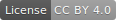

# Imago Dev

[Imago Dev](https://www.imago.dev/), is a website and blog, run by Cameren Dolecheck, exploring the connection between the developer and their work, especially in the realm of creative coding.
  

This site was built with [GatsbyJs](https://www.gatsbyjs.org). Thanks to [Atte Juvonon](https://www.attejuvonen.fi) for the creation of the [blog starter](https://github.com/baobabKoodaa/blog) which this site used as a template.

You are free to use this repo to create your own blog (code is MIT licensed). You may also use the written content in this blog however you like, provided that you [give appropriate credit](https://creativecommons.org/licenses/by/4.0) (CC BY 4.0).